# Clear Current marketing website — phase-by-phase plan

**Purpose:** Single roadmap for building the new **clearcurrent.ai** public marketing site. This is **separate from** the internal/strategic **portal** in this repo. Use this document for readiness reviews before coding starts.

**Inputs:** _Clear Current Website Build Spec_ (v1.0, April 2026) plus repo and integration decisions below.

**How to use phases:** Complete exit criteria before treating a phase as done. Phases can overlap slightly (e.g., content drafting during build), but **order matters** where noted.

---

## Scope recap

| In scope                                                                                                              | Out of scope (unless explicitly added later)                    |
| --------------------------------------------------------------------------------------------------------------------- | --------------------------------------------------------------- |
| Enterprise-credible marketing site, demo-first CTAs                                                                   | Authenticated product app                                       |
| Routes and templates per spec (Home, About, Contact, Platform, Solutions ×4, Industries ×3, Blog, Press, legal links) | “Build Engine” / unpublished modules until stakeholders confirm |
| Design system, motion, responsive layouts                                                                             | Custom CMS (can start static or MD-based)                       |

---

## Phase 0 — Readiness, ownership, and decisions

**Goal:** Remove blockers that cause rework or launch delays.

### 0.1 Stakeholder and content ownership

- [ ] **Name who approves** copy, design, and launch (e.g., John/Dan for product claims and numbers).
- [ ] **Confirm brand assets:** logo master (SVG preferred), color checks on real displays, any investor logos for “Backed by” fallback.
- [ ] **Legal:** entity name, address, email for footer; owner for Privacy Policy and Terms (draft or external counsel).

### 0.2 Technical placement (must decide before Phase 1)

Pick one path and record it in the repo README or ADR:

| Option                                                                           | Implication                                                                                           |
| -------------------------------------------------------------------------------- | ----------------------------------------------------------------------------------------------------- |
| **A — New Vite app** (per spec: `clearcurrent-site` or `apps/clearcurrent-site`) | Matches spec literally; separate deploy from any existing Next app.                                   |
| **B — Next.js app** (e.g. existing `apps/website`)                               | Same UX/IA as spec; adjust “stack” section of spec so implementation matches (routing, CSS pipeline). |

**Exit criterion:** Written decision: which app shell, package name, and production domain mapping (e.g. `clearcurrent.ai` → which project).

### 0.3 Conversion and communications stack

- [ ] **Contact form:** destination (CRM, email API, form SaaS). Define success/error UX and spam strategy (honeypot, CAPTCHA if required).
- [ ] **Footer mailing list:** provider and double opt-in requirements; who manages the list.
- [ ] **Analytics** (if any): tool and privacy policy alignment (cookie banner only if needed).

### 0.4 Content and claims readiness (parallel track)

- [ ] Resolve **Section 8 open questions** from the build spec (stats, customer logos, named quotes, press URLs, Sign In in nav, Eric Hines / team, Area of Interest dropdown, public mention of $4.275M, Build Engine status).
- [ ] **Blog:** plan for ≥3 launch posts (titles in spec are a starting point; assign authors and review).

**Exit criterion:** Decision log (even a simple table) with owner and target date for each open item.

---

## Phase 1 — Foundation (design system + shell)

**Goal:** A runnable app with global styles, motion primitives, layout chrome, and routes—no final copy required.

### 1.1 Project bootstrap

- Scaffold per chosen stack (Vite + React or Next).
- Install and configure: Tailwind v4 (Vite plugin path if Vite), Framer Motion, `react-router-dom` (Vite) or App Router routes (Next), `lucide-react`, `@fontsource/dm-serif-display`, `@fontsource/geist`, `clsx` + `tailwind-merge`.
- Global CSS: Tailwind import, font imports, `:root` tokens from spec, base `body` / heading rules.

### 1.2 Shared primitives

- `src/lib/motion.js` (or equivalent): `EASE`, `fadeUp`, `fadeIn`, `stagger`, `scaleIn`, `viewportOptions`—single source for motion.
- UI: `Button` (primary, secondary, ghost, ghost-white), `SectionLabel`, `AnimatedNumber`, `LogoMarquee` (CSS marquee; placeholder pills if no logos).

### 1.3 Layout

- `Nav`: transparent → blur on scroll; dropdowns per IA; **Request Demo** persistent; optional Sign In only if stakeholders approve.
- `Footer`: five-column IA, mailing list block, bottom bar (©, Privacy, Terms); gold rules respected.

### 1.4 Routing

- Wire all routes (empty pages or stubs): `/`, `/about`, `/contact`, `/platform`, `/solutions/billing-intelligence`, `/solutions/portfolio-command`, `/solutions/procurement-hub`, `/industries/higher-education`, `/industries/healthcare`, `/industries/commercial-real-estate`, `/blog`, `/press`, plus `/privacy` and `/terms` if required for launch.

**Exit criterion:** App runs locally; every route resolves; nav/footer appear on all pages; tokens and motion presets used consistently; no Inter font; no purple/teal palette drift.

---

## Phase 2 — Homepage (vertical slice)

**Goal:** One full page that proves design, rhythm, and motion at three breakpoints.

Build top to bottom per spec:

1. Hero (mid-navy, gradients, noise, headline, CTAs, stat bar with placeholders/TODO if needed).
2. Logo wall (`LogoMarquee` or industry pills).
3. How it works (copy + SVG diagram; stagger/scale motion).
4. Product suite (bento grid, four modules + Platform link).
5. Social proof (three static quote cards—**no carousel**—plus metric row).
6. Press or “Backed by” fallback if <3 press items.
7. CTA banner.
8. Footer (already global).

**Exit criterion:** Homepage matches section background rhythm (light/dark alternation); gold usage passes audit (labels, CTAs, stats on dark, one accent line max per section); responsive at ~375 / 768 / 1280 px; primary CTA always points to `/contact`.

---

## Phase 3 — Core story pages

**Goal:** About, Contact, and Platform tell the story and convert.

### 3.1 About

- Mission hero, origin story (55/45 layout), team grid with bios and LinkedIn; placeholders only where stakeholders have not approved photos/names.

### 3.2 Contact

- Two-column layout: left value prop + optional testimonial blocks + stats; right form card.
- Fields: First name, last name, work email, company, job title, area of interest (dropdown), optional message; submit wired to chosen backend or stub with clear TODO.

### 3.3 Platform

- Architecture overview aligning with “three layers” narrative and links into solution pages.

**Exit criterion:** All CTAs use **Request Demo →**; voice rules (no “AI-powered” headlines, no banned filler words); form behavior defined (even if staging endpoint).

---

## Phase 4 — Solutions and industries (templates + copy)

**Goal:** Repeatable templates filled with final or approved placeholder copy.

### 4.1 Solution pages (4)

- `/solutions/billing-intelligence`, `/solutions/portfolio-command`, `/solutions/procurement-hub`, plus Platform at `/platform` (not under `/solutions/`—keep breadcrumbs accurate).
- Template: breadcrumb, problem-led hero, three prose sections (no bullets), stat row, bottom CTA, cross-links, related resources (blog links can be TBD).
- **Exclude** “Build Engine” unless product confirms it is live.

### 4.2 Industry pages (3)

- `/industries/higher-education`, `/industries/healthcare`, `/industries/commercial-real-estate`.
- Template: hero, pain points, capability mapping, optional vertical quote, CTA banner.
- Copy sourced from approved interview/debrief material when available.

**Exit criterion:** Each page type reviewed once; internal links work; no bullet-heavy solution body copy.

---

## Phase 5 — Resources (Blog and Press)

**Goal:** Discoverability and credibility without overbuilding CMS on day one.

### 5.1 Blog index + posts

- Index: grid of cards (category, title, excerpt, date, read more).
- Minimum **three** posts at launch per spec—either static MD/JSX or headless CMS; choose what Phase 0 allows.

### 5.2 Press

- List layout: publication, linked headline, date; fallback content if coverage is thin.

**Exit criterion:** No empty blog at launch; press items are real links or intentional fallback section.

---

## Phase 6 — Legal, meta, and SEO baseline

**Goal:** Trust and sharing defaults.

- [ ] Privacy Policy and Terms: real pages or approved external PDFs linked consistently.
- [ ] Per-page `<title>` and meta description; Open Graph image strategy (single default asset vs per page).
- [ ] `robots.txt` / `sitemap.xml` as appropriate for production domain.
- [ ] Favicon and social preview asset checklist.

**Exit criterion:** Footer legal links work; sharing a URL produces sensible previews.

---

## Phase 7 — Integrations and operations

**Goal:** Production-ready pipelines, not just static HTML.

- [ ] Contact form connected to production endpoint; test submissions; error states.
- [ ] Newsletter signup connected; confirmation email if required.
- [ ] Analytics (if used): installed, documented, GDPR/cookie stance documented.
- [ ] **Vercel** (or chosen host): project settings, env vars, preview deployments, branch strategy.
- [ ] Domain: DNS, SSL, redirects from old WordPress URLs if needed (301 map).

**Exit criterion:** Stakeholder can submit a demo request and see it in the chosen system end to end.

---

## Phase 8 — Quality bar (QA, a11y, performance)

**Goal:** Enterprise-credible polish.

### 8.1 Responsive and visual QA

- Full pass at mobile, tablet, desktop; fix overflow and nav/footer edge cases.

### 8.2 Motion and design audits

- Motion audit: scroll triggers, no jank; respect `prefers-reduced-motion` where feasible.
- Typography scale check against spec.
- **Gold audit:** ≤3 gold touches per section per spec; no gold body text or large gold backgrounds.

### 8.3 Accessibility

- Focus order, keyboard nav, form labels, contrast on navy/gold, semantic headings.

### 8.4 Performance

- Image optimization strategy; font loading; Core Web Vitals sanity check on production-like build.

**Exit criterion:** Checklist signed off by owner; no known launch blockers.

---

## Phase 9 — Launch and handoff

**Goal:** Controlled go-live and maintainability.

- [ ] **Launch checklist:** DNS cutover, form test in prod, 404 page on-brand, monitoring/alerts if applicable.
- [ ] **Handoff doc:** how to edit copy, add blog posts, update press, who to call for DNS/forms.
- [ ] **Post-launch:** schedule for replacing TODO stats/quotes/logos when stakeholders deliver assets.

**Exit criterion:** Site live at production domain; team knows how to update content.

---

## Dependency overview

```mermaid
flowchart LR
  P0[Phase 0 Readiness]
  P1[Phase 1 Foundation]
  P2[Phase 2 Homepage]
  P3[Phase 3 Core pages]
  P4[Phase 4 Solutions Industries]
  P5[Phase 5 Blog Press]
  P6[Phase 6 Legal SEO]
  P7[Phase 7 Integrations]
  P8[Phase 8 QA]
  P9[Phase 9 Launch]
  P0 --> P1
  P1 --> P2
  P2 --> P3
  P3 --> P4
  P4 --> P5
  P5 --> P6
  P6 --> P7
  P7 --> P8
  P8 --> P9
```

**Note:** Content drafting (stats, quotes, blog posts) should **start in Phase 0** and run parallel to Phases 1–5 so launch is not blocked.

---

## Open questions (carry until answered)

Track these explicitly—the build spec ties them to specific page areas:

| Topic                                           | Affects                            |
| ----------------------------------------------- | ---------------------------------- |
| Public stats (errors found, $ recovered, sites) | Hero, contact, solution stat rows  |
| Customer or pilot logos                         | Logo wall                          |
| Named quotes with title + company               | Social proof, contact column       |
| Build Engine / Site Intelligence live?          | Solution count and nav             |
| Press items with URLs                           | Press section vs investor fallback |
| Eric Hines COO / About team                     | About page                         |
| Sign In in nav                                  | Nav                                |
| Area of Interest dropdown options               | Contact form                       |
| Public $4.275M statement                        | Investors, stats                   |

---

## Definition of “ready to start coding”

Minimum:

1. Phase **0.2** (where the app lives) decided.
2. Phase **0.3** at least **chosen** (even if integrations are stubbed with TODOs, the plan is set).
3. Phase **0.4** assigned to owners; team accepts placeholder + TODO strategy until answers arrive.

---

## Definition of “ready to launch”

Minimum:

1. Phase **0.4** items either answered or explicitly deferred with business approval (no contradictory “no placeholders” rule unless relaxed).
2. Phases **6–8** complete; Phase **7** production integrations verified.
3. Blog has ≥3 real posts; legal links work; forms and newsletter work in production.

---

_Document version: 1.0 | Align with Website Build Spec v1.0 (April 2026). Update this file when stack, routes, or launch requirements change._
